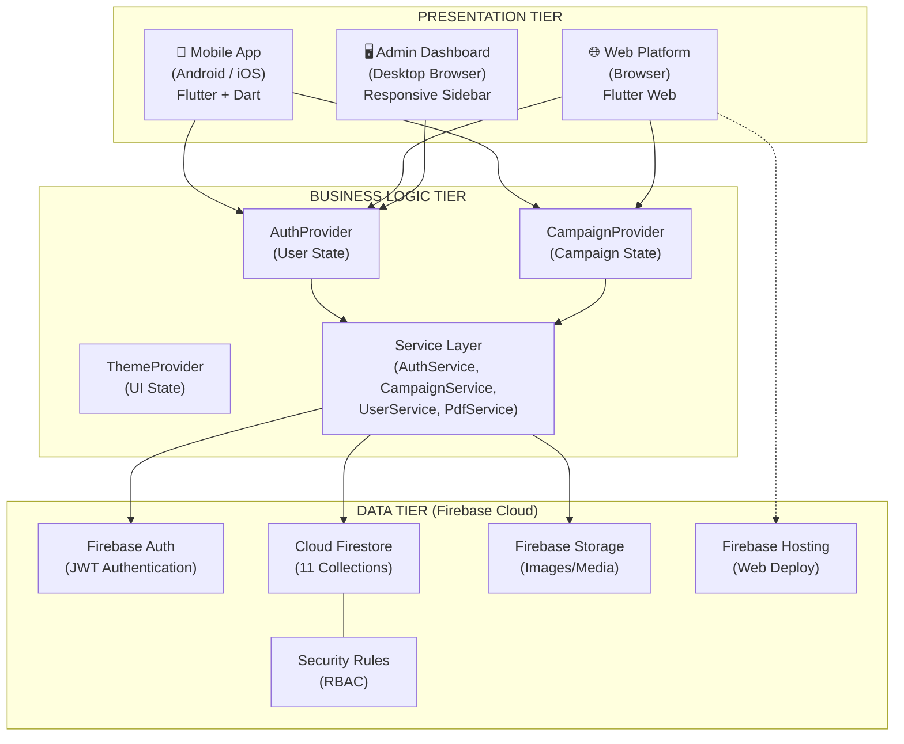
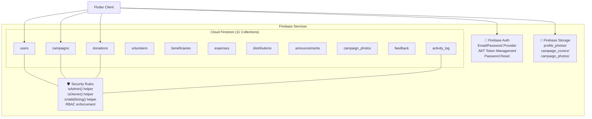
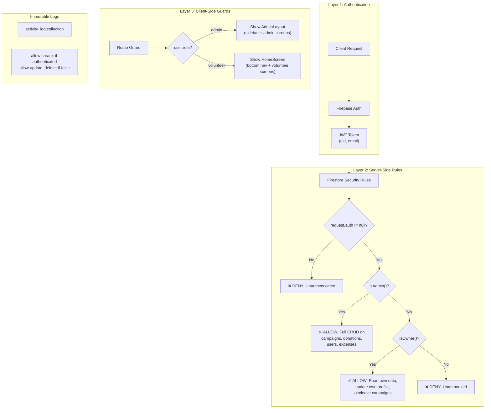
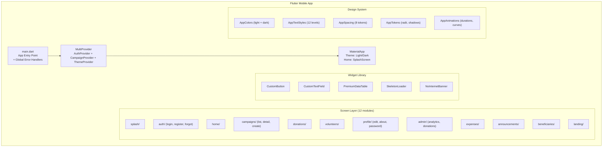
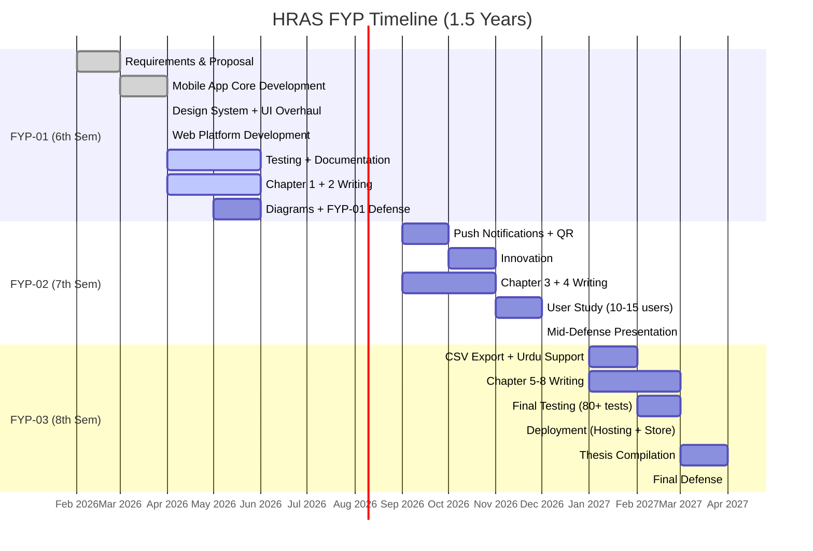

# Architecture + Planning Diagrams — HRAS NGO System
# Render at https://mermaid.live — Export as PNG for Word thesis

---

## 20. THREE-TIER SYSTEM ARCHITECTURE

---

## 21. FIREBASE BACKEND ARCHITECTURE

---

## 22. SECURITY / RBAC ARCHITECTURE

---

## 23. MOBILE APP ARCHITECTURE

---

## 24. WBS (Work Breakdown Structure)

```mermaid
graph TB
    ROOT["HRAS NGO<br/>Management System"]

    ROOT --> WP1["WP1: Project<br/>Management"]
    ROOT --> WP2["WP2: Requirements<br/>& Design"]
    ROOT --> WP3["WP3: Mobile App<br/>Development"]
    ROOT --> WP4["WP4: Web Platform<br/>Development"]
    ROOT --> WP5["WP5: Backend &<br/>Security"]
    ROOT --> WP6["WP6: Testing &<br/>Quality"]
    ROOT --> WP7["WP7: Documentation<br/>& Thesis"]

    WP1 --> W11["Proposal"]
    WP1 --> W12["Timeline planning"]
    WP1 --> W13["Progress reports"]

    WP2 --> W21["Stakeholder analysis"]
    WP2 --> W22["Requirements doc"]
    WP2 --> W23["UML diagrams"]
    WP2 --> W24["UI/UX wireframes"]

    WP3 --> W31["Auth module"]
    WP3 --> W32["Campaign module"]
    WP3 --> W33["Donation module"]
    WP3 --> W34["Volunteer module"]
    WP3 --> W35["Profile module"]
    WP3 --> W36["Design system"]

    WP4 --> W41["Landing page"]
    WP4 --> W42["Admin dashboard"]
    WP4 --> W43["Responsive layout"]
    WP4 --> W44["Web-specific widgets"]

    WP5 --> W51["Firebase setup"]
    WP5 --> W52["Firestore rules"]
    WP5 --> W53["Authentication"]
    WP5 --> W54["Storage config"]

    WP6 --> W61["Unit tests"]
    WP6 --> W62["Integration tests"]
    WP6 --> W63["Security audit"]
    WP6 --> W64["Performance review"]

    WP7 --> W71["Ch 1-2 (FYP-01)"]
    WP7 --> W72["Ch 3-4 (FYP-02)"]
    WP7 --> W73["Ch 5-8 (FYP-03)"]
    WP7 --> W74["Final thesis"]
```

---

## 25. GANTT CHART (Text Representation)

---

## 26. SDLC MODEL — Agile Iterative

```mermaid
graph LR
    subgraph "Iteration 1 (FYP-01)"
        R1["Requirements<br/>Gathering"] --> D1["Design<br/>(Architecture)"]
        D1 --> I1["Implementation<br/>(Core App)"]
        I1 --> T1["Testing<br/>(Unit Tests)"]
        T1 --> E1["Evaluation<br/>(Supervisor Review)"]
    end

    subgraph "Iteration 2 (FYP-02)"
        R2["Enhanced<br/>Requirements"] --> D2["Detailed<br/>Design"]
        D2 --> I2["Advanced<br/>Features"]
        I2 --> T2["Integration<br/>Testing"]
        T2 --> E2["User Study<br/>Evaluation"]
    end

    subgraph "Iteration 3 (FYP-03)"
        R3["Final<br/>Scope"] --> D3["Deployment<br/>Design"]
        D3 --> I3["Polish +<br/>Deploy"]
        I3 --> T3["System<br/>Testing"]
        T3 --> E3["Final<br/>Defense"]
    end

    E1 -->|"Feedback"| R2
    E2 -->|"Feedback"| R3
```

---

## 27. RISK MANAGEMENT MATRIX

| # | Risk | Probability | Impact | Mitigation |
|---|------|-------------|--------|------------|
| 1 | Firebase free tier exceeded | Low | High | Monitor usage; upgrade plan if needed |
| 2 | Data loss during development | Medium | Critical | Firestore auto-backups; Git version control |
| 3 | Scope creep (too many features) | High | Medium | Fixed scope per semester; say no to extras |
| 4 | Internet unavailable during demo | Medium | High | Mobile hotspot backup; pre-recorded video |
| 5 | Flutter web performance issues | Medium | Medium | Lazy loading; image optimization; tree-shaking |
| 6 | Security vulnerability discovered | Low | Critical | Firestore rules; regular security audit |
| 7 | Team member unavailability | Low | Medium | Solo project; documented for handoff |
| 8 | Examiner questions on testing | High | High | Expand test suite to 80+; document results |
