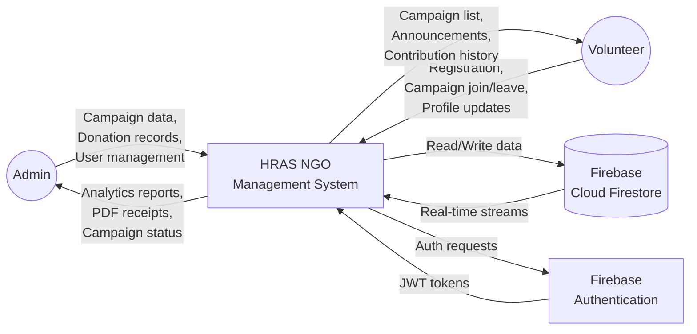
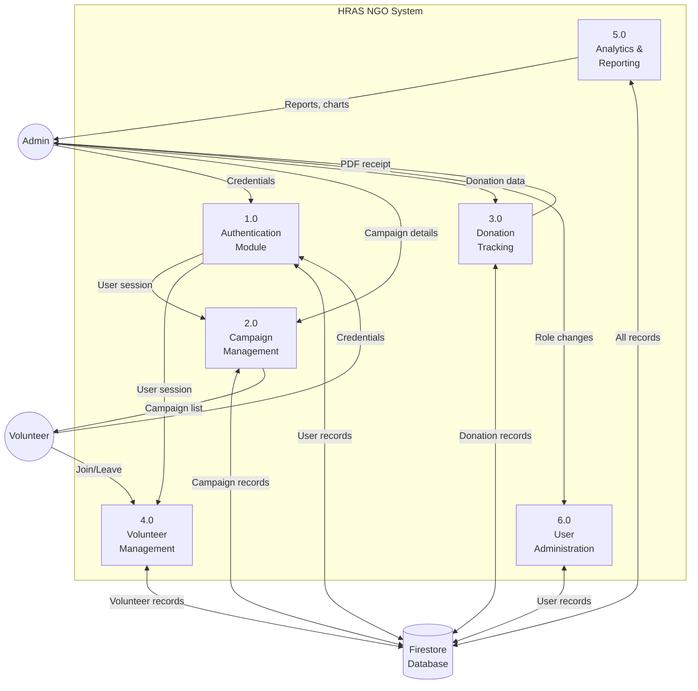
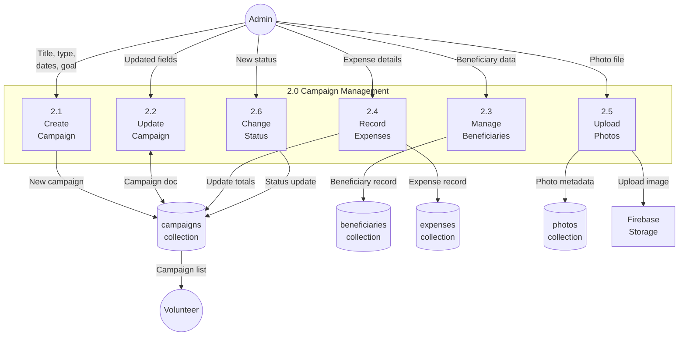
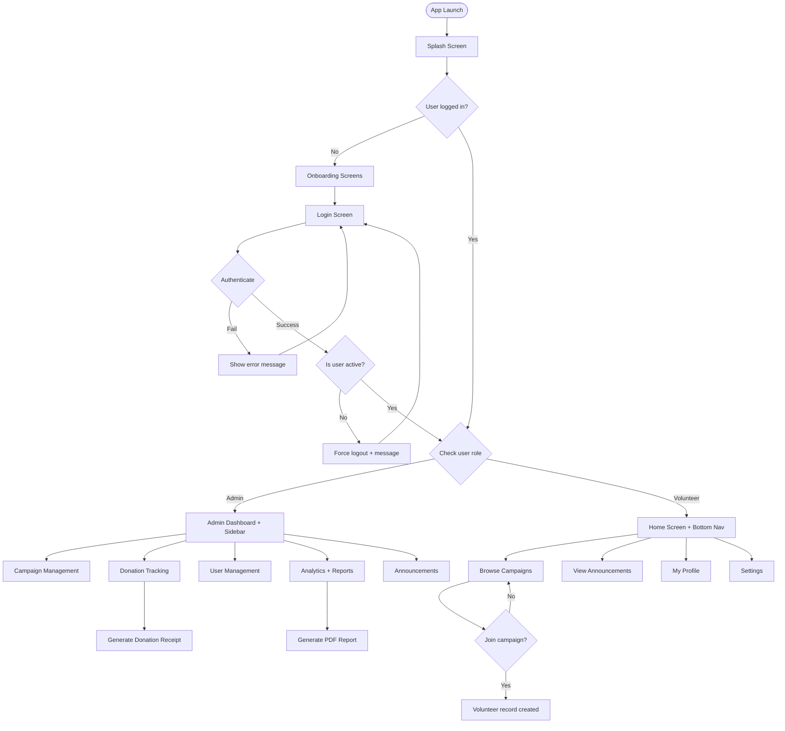
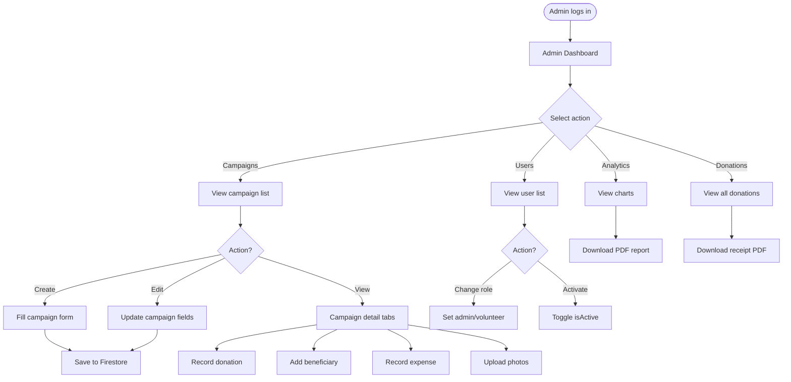
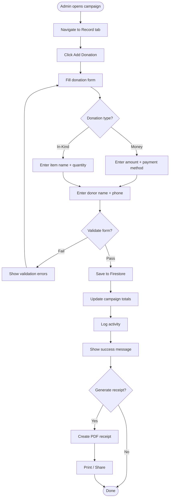
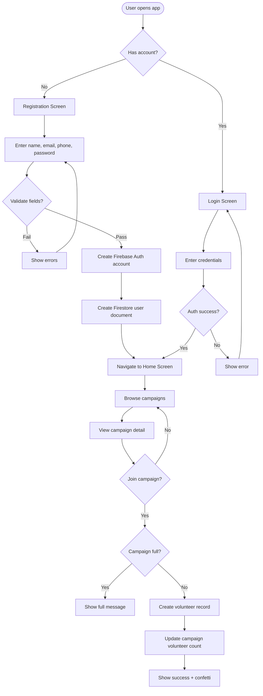
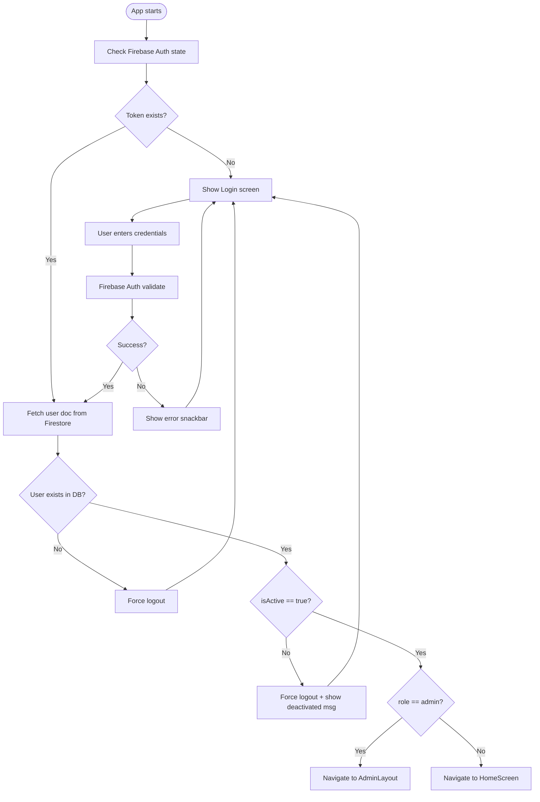
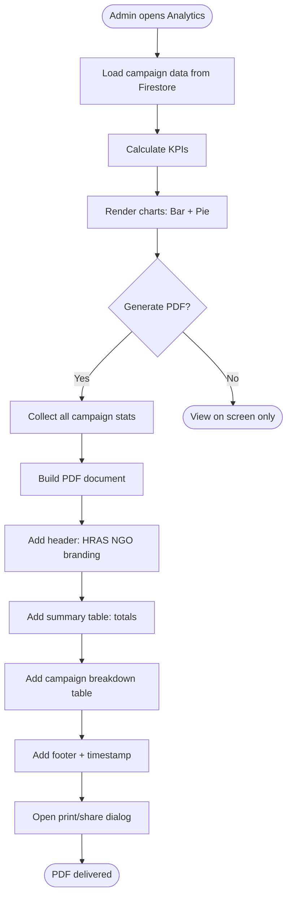

# Data Flow Diagrams + System Flowcharts — HRAS NGO System
# Render at https://mermaid.live — Export as PNG for Word thesis

---

## 11. DFD LEVEL 0 (Context Diagram)

---

## 12. DFD LEVEL 1

---

## 13. DFD LEVEL 2 — Campaign Management (Process 2.0)

---

## 14. SYSTEM FLOWCHART (Complete System)

---

## 15. ADMIN WORKFLOW FLOWCHART

---

## 16. DONATION PROCESS FLOWCHART

---

## 17. VOLUNTEER REGISTRATION FLOWCHART

---

## 18. AUTHENTICATION FLOWCHART

---

## 19. REPORT GENERATION FLOWCHART

