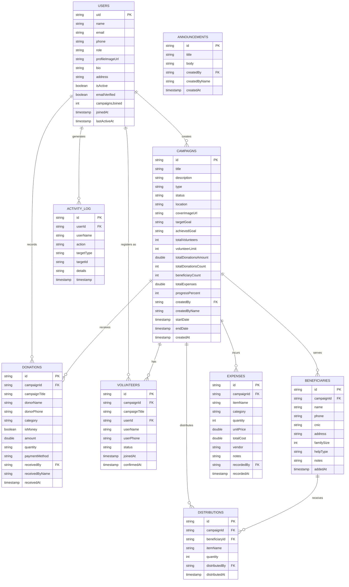
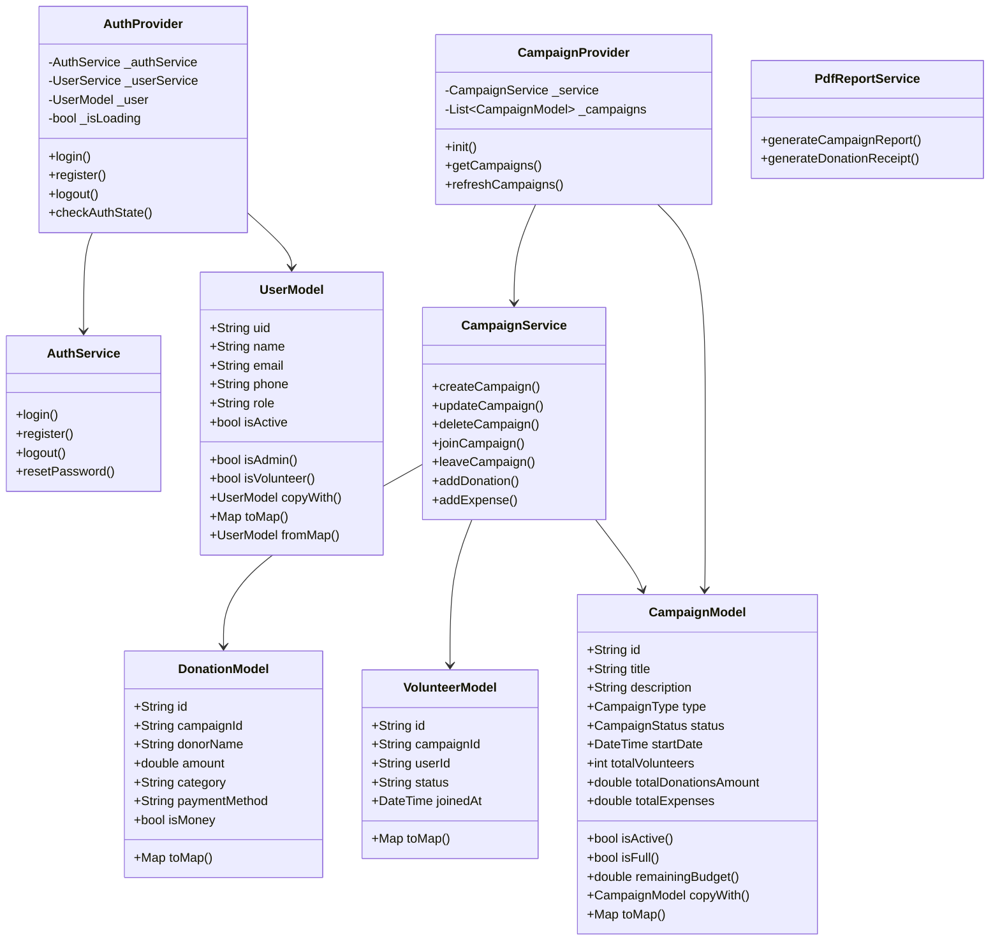
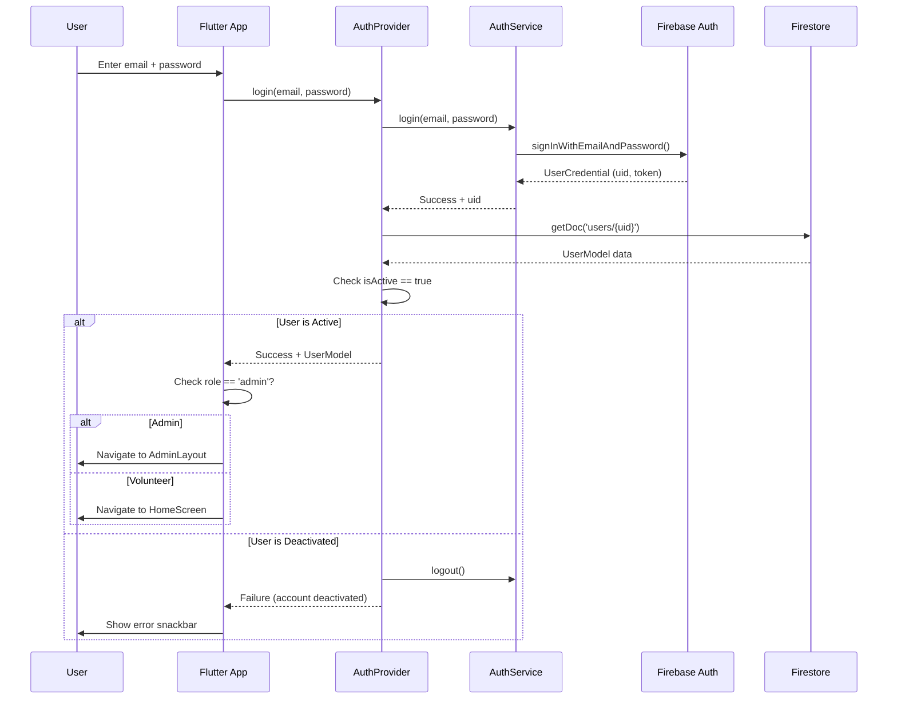
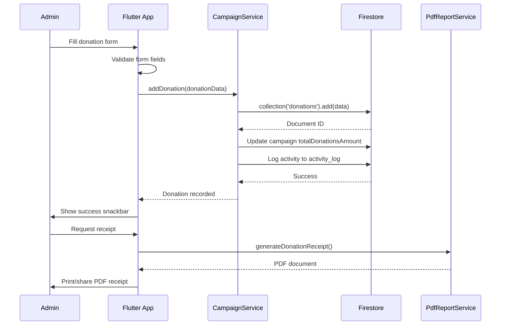
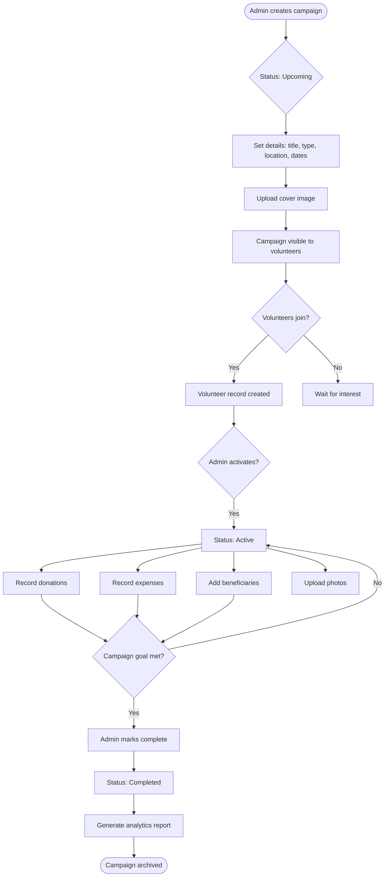
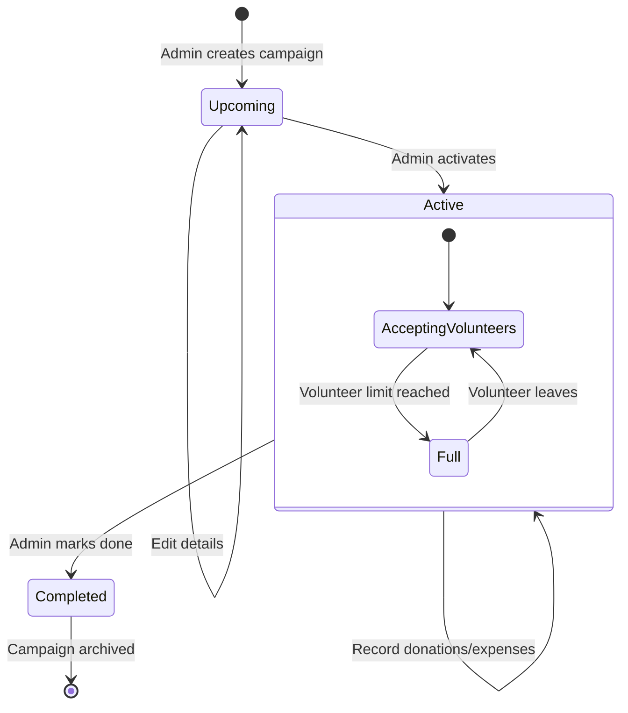
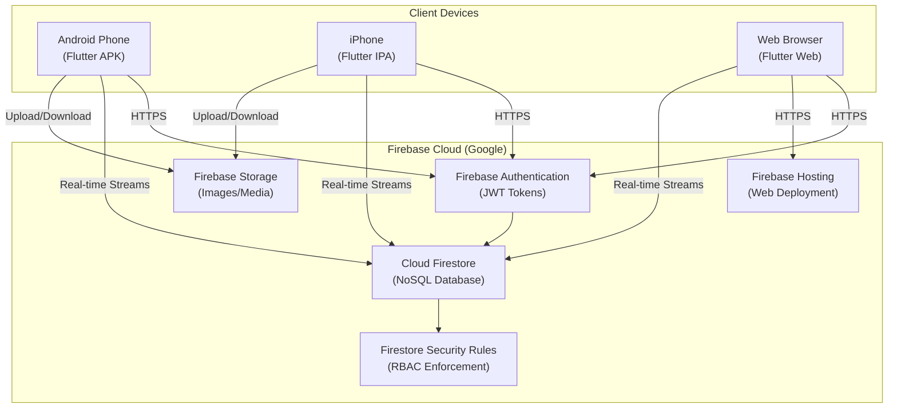
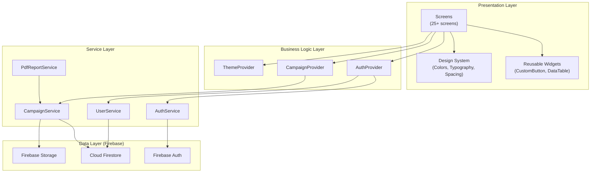
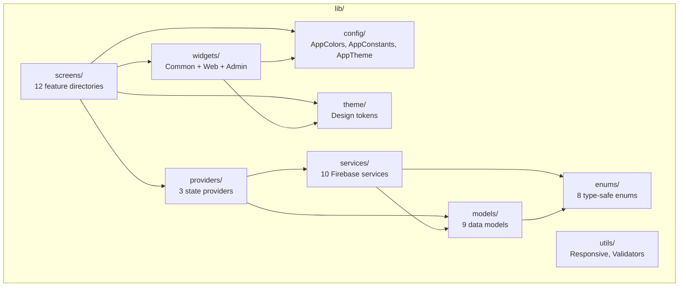

# UML Diagrams — HRAS NGO Management System
# Render these at https://mermaid.live or in VS Code with Mermaid plugin
# Export as PNG/SVG for Word thesis insertion

---

## 1. USE CASE DIAGRAM

```mermaid
graph TB
    subgraph "HRAS NGO System"
        UC1["Register Account"]
        UC2["Login / Logout"]
        UC3["View Campaigns"]
        UC4["Join Campaign"]
        UC5["Leave Campaign"]
        UC6["View Announcements"]
        UC7["Edit Profile"]
        UC8["Toggle Dark Mode"]
        UC9["Create Campaign"]
        UC10["Edit Campaign"]
        UC11["Delete Campaign"]
        UC12["Record Donation"]
        UC13["Manage Volunteers"]
        UC14["Manage Users"]
        UC15["View Analytics"]
        UC16["Generate PDF Report"]
        UC17["Record Expense"]
        UC18["Manage Beneficiaries"]
        UC19["Upload Photos"]
        UC20["Create Announcement"]
        UC21["Download Donation Receipt"]
        UC22["Change User Role"]
        UC23["Activate/Deactivate User"]
    end

    Volunteer((Volunteer))
    Admin((Admin))

    Volunteer --> UC1
    Volunteer --> UC2
    Volunteer --> UC3
    Volunteer --> UC4
    Volunteer --> UC5
    Volunteer --> UC6
    Volunteer --> UC7
    Volunteer --> UC8

    Admin --> UC2
    Admin --> UC3
    Admin --> UC9
    Admin --> UC10
    Admin --> UC11
    Admin --> UC12
    Admin --> UC13
    Admin --> UC14
    Admin --> UC15
    Admin --> UC16
    Admin --> UC17
    Admin --> UC18
    Admin --> UC19
    Admin --> UC20
    Admin --> UC21
    Admin --> UC22
    Admin --> UC23
```

---

## 2. ER DIAGRAM (Database Design — 9 Entities)

---

## 3. CLASS DIAGRAM

---

## 4. SEQUENCE DIAGRAM — User Login Flow

---

## 5. SEQUENCE DIAGRAM — Donation Recording

---

## 6. ACTIVITY DIAGRAM — Campaign Lifecycle

---

## 7. STATE DIAGRAM — Campaign Status

---

## 8. DEPLOYMENT DIAGRAM

---

## 9. COMPONENT DIAGRAM

---

## 10. PACKAGE DIAGRAM

